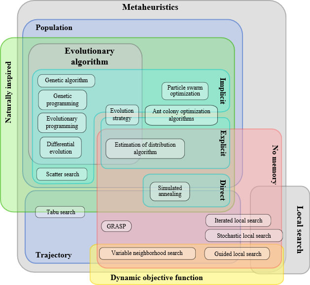
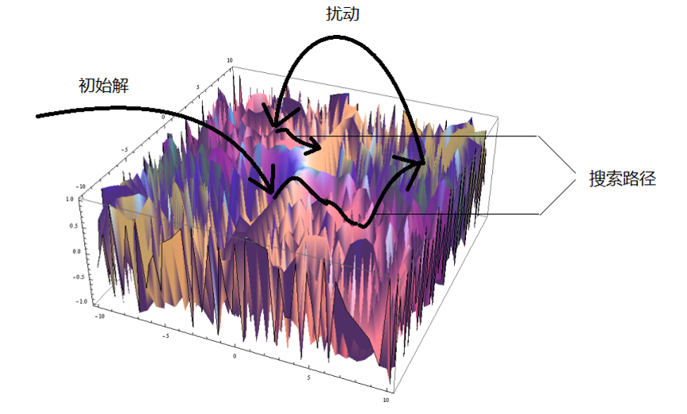
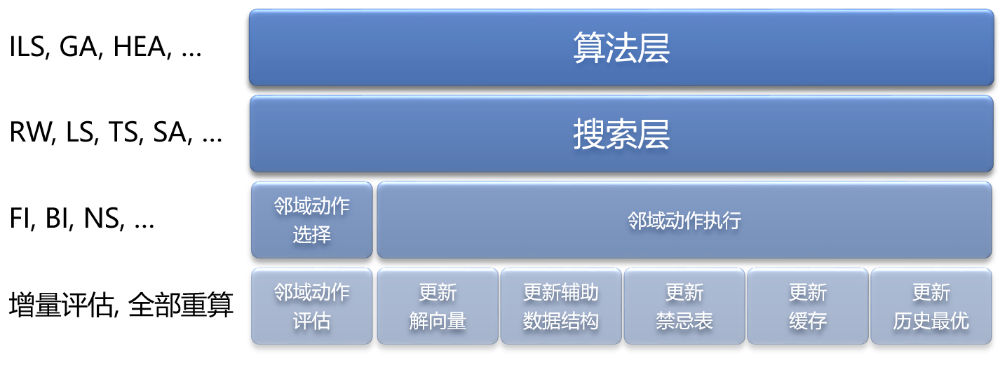
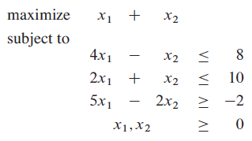
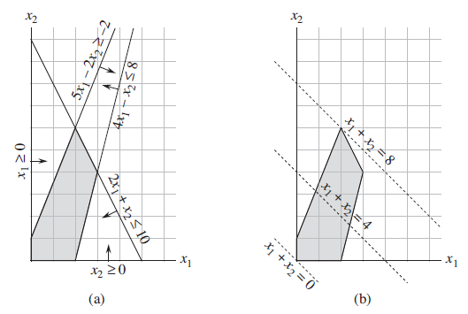
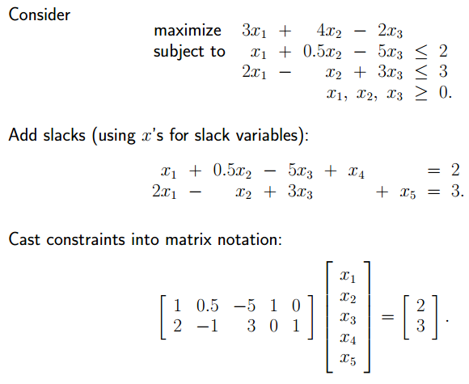
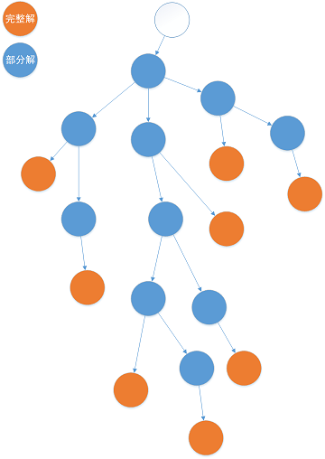
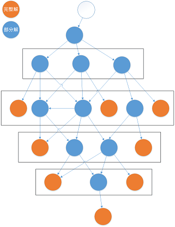
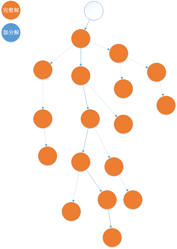

由于生产实践中面临的绝大多数具有实际意义的组合优化问题都已经在理论上被证明属于难以使用可接受的计算资源在可接受的时间内求解的 NP-Hard 问题, 其求解算法不像 P 问题一样存在标准答案.
此外, 在实际的工业应用中, 由于未来的不确定性以及评价指标常常无法完美量化等问题, 耗费大量计算资源和时间精确求出最优解几乎没有实际意义.
所以, 组合优化算法的设计往往是在优度与速度之间寻找平衡点.

# 算法设计

## 预处理 (Preprocess)

- 缩减问题规模 (Reduction)
  - 参考文献: [Polynomial-time data reduction for dominating set](https://doi.org/10.1145/990308.990309)
- 加载用户参数与算法默认参数
- 初始化辅助数据结构

## 精确算法 (Exact Algorithms)

- 分支限界 (Branch and Bound)
  - 分支策略 (Branching)
    - 深度优先 (Depth-First Search)
    - 广度优先 (Breadth-First Search)
    - 优度优先 (Best-First Search)
  - 剪枝策略 (Pruning)
    - 可行性剪枝 (Feasibility Pruning)
    - 上下界剪枝 (Bound Pruning)
      - (最小化问题) 当前目标函数值 + 剩余部分下界 < 上界
      - A* 算法实质上是该策略在特定问题上的一种高效实现
    - 支配性剪枝 (Dominance Pruning)
      - 动态规划实质上是将该策略发挥到了极致
    - 参考文献: [On an exact method for the constrained shortest path problem](https://doi.org/10.1016/j.cor.2012.07.008)
- 线性规划与混合整数规划求解算法 (Mathematical Programming)
  - 单纯形法 (Simplex Method)
  - 内点法 (Interior Point Method, Barrier Method)
  - 分支切割/割平面法 (Branch and Cut, Cutting Plane Method)
  - 分支定价/列生成 (Branch and Price, Column Generation)
- 动态规划 (Dynamic Programming)
  - 递推函数 (Recursive Formulation)
  - 重叠子问题/最优子结构 (Overlapping Subproblem, Optimal Substructure)
- 其他经典算法
  - 最大流 (Maximum Flow)
  - 最小费用流 (Minimum-Cost Flow)
  - 完美匹配/最大匹配 (Perfect Matching, Maximum Matching, Assignment Problem)
- 参考文献
  - http://theory.stanford.edu/~amitp/GameProgramming/
  - https://www.redblobgames.com/pathfinding/a-star/introduction.html
  - https://www.redblobgames.com/pathfinding/a-star/implementation.html

## 元启发式算法 (Metaheuristics)

### 概述

- 分类    
  
- 基本思想
  - 在 系统地探索整个解空间 和 盲目地探索邻近的解空间 之间寻找平衡点
  - 集中性 (Intensification) 与 疏散性 (Diversification) 的平衡
    - 也称为 探索 (Exploration) 与 利用 (Exploitation) 的平衡
  - 时空开销 (Complexity) 与 求解质量 (Quality) 的平衡
- 邻域动作 (Neighborhood Move): 尝试对解向量做微小的改变
  - 在一次迭代中每一个决策变量都可以改变: 精确算法
  - 在一次迭代中仅改变一个决策变量: 原子邻域动作
  - 寻找两者的平衡点: 集中性与疏散性的平衡
- 迭代禁忌搜索过程  
    
  - 使用贪心算法或随机生成一个初始解
  - 每次从当前解移动到某个邻居解 (Neighboring Solution), 直至一定步数不能改进
  - 然后进行扰动, 贪心或随机地对更改部分解向量, 重复上述过程
- 元启发式算法框架  
    
  - 算法层为整个程序的框架, 比如迭代局部搜索, 遗传算法, 混合进化算法等.
      算法层决定了使用那些搜索策略, 搜索策略之间以什么次序出现, 各搜索策略的初始解, 各搜索策略的停止策略参数控制 (停止条件), 整个算法的停止条件等.
  - 搜索层是具体的搜索算法, 执行一次搜索会产生一条搜索路径 (Trajectory). 随机游走, 模拟退火, 局部搜索, 禁忌搜索等都是搜索层的组件.
    从广义上来说, 构造初始解, 迭代局部搜索中的扰动过程, 遗传算法中的交叉算子都是搜索层的组件.
    在搜索过程中, 要考虑的主要问题是每次迭代选择什么邻域结构进行探索, 以及决定停止搜索的策略.
    比如TS的停止策略是一定步数未改进就停止, 而停止条件是一个特定的最大未改进步数具体取值.
  - 邻域动作选择一般是搜索过程中对算法性能影响最大的模块.
    它通过循环调用邻域动作评估层的组件对考虑范围之内的邻域动作对目标函数值的改变情况进行评估, 然后按照某种策略挑选其中的一个动作.
    最常见的挑选策略有 首次改进 (First Improvement) 和 最优改进 (Best Improvement). 此外, 还可以有导向性地或者随机地在整个邻域中挑选一部分邻域动作进行评估.
  - 邻域动作评估可以是结合特殊的数据结构进行增量评估或者全部重算. 在绝大多数情况下增量评估的速度会远快于全部重算.
  - 邻域动作的执行比较简单, 主要有更新解向量, 更新辅助数据结构, 更新禁忌表, 更新缓存和更新历史最优解等操作.
    其中更新历史最优主要是处理目标函数值相同的情况, 可以随机选择, 也可以设计辅助目标函数进行处理.
- 邻域动作举例
  - Boolean Satisfiability Problem (SAT)
  - Graph Coloring Problem
  - P-Center Problem
  - Personnel Scheduling Prblem
  - Traveling Salesman Problem
- 常用算法
  - 提升算法 (Trajectory-Based Methods)
    - 迭代禁忌搜索
    - 模拟退火 (类似 Epsilon-Greedy 策略)
    - 拍卖算法/地貌调整/格局检测 (Auction Algorithm, Landscape Adjustment, Configuration Checking)
      - 提升反复出现的惩罚项在目标函数中的权重实现 "软" 禁忌
        - 例如图着色中令 反复出现的 或者 局部最优解中的 冲突边的计 1.01 条冲突边
  - 种群算法 (Population-Based Methods)
    - 混合进化算法/模因算法 (Hybrid Evolutionary Algorithm, Memetic Algorithm), 遗传算法 (Genetic Algorithm)
    - 蚁群, 蜂群, 粒子群 (与强化学习十分相似)

### 初始解 (Initial Solution Generation)

- 贪心 (Greedy)
  - 有利于快速收敛 (Fast Convergence)
  - 不利于初始解的多样性
- 随机 (Random)

### 禁忌搜索 (Tabu Search)

- 邻域结构 (Neighborhood Structure) 设计
  - 原子邻域动作
    - 添加, 删除, 更换, 交换, 移动, ...
  - 复合邻域动作
    - 块交换, 块移动
    - 大邻域搜索 (Large Neighborhood Search)
    - 弹射链 (Ejection Chain)
- 邻域评估 (Neighborhood Evaluation): 目标函数值改进量计算
  - 增量评估 (Incremental Evaluation): 因为仅对解向量做了微小的改变, 所以目标函数中大多数项目并未改变
  - 邻域缓存 (Cache): 在邻域动作执行后, 大多数邻域动作与被改变的决策变量并不相关, 其增量无需重新计算, 故可以将其缓存起来
    - 主动更新 (Active Update): 每次执行邻域动作后更新所有相关动作的增量
    - 惰性更新 (Lazy Update): 使用标记位记录缓存是否失效, 需要比较相关动作的增量时再更新
      - 启用了邻域精简或抽样策略时才有惰性更新的必要
- 邻域动作选择策略
  - 单个邻域 (直接选择邻域动作)
    - 首次改进 (First Improvement)
      - 记录上一轮的评估进度直接从下一个动作开始, 循环评估所有动作
      - 每次从随机位置开始依次评估所有邻域动作
    - 最大改进 (Best Improvement)
      - 多个目标函数增量相同的最优动作随机选择一个
        - 在线选择 (Online Selection): [水塘抽样 (Reservoir Sampling)](https://en.wikipedia.org/wiki/Reservoir_sampling)
    - 邻域精简/候选动作集 (Neiborhood Reduction, Candidate Set)
      - 根据特定策略筛选排除显然没有改进潜力的动作
    - 邻域近似评估 (Neihborhood Estimation, Approximate Evaluation)
      - 根据其他辅助指标快速对所有动作排序, 仅对排名靠前的若干动作进行精确评估
    - 邻域抽样 (Neighborhood Sampling)
  - 多邻域 (先选出邻域结构再选择动作)
    - 评估所有邻域的所有动作
      - 可以结合邻域抽样随机挑选部分动作
    - 变邻域搜索 (Variable Neighborhood Search)
    - 根据适应性选择最合适的邻域
      - 根据历史改进情况调整各邻域权重, 然后采用轮盘赌 (Roulette Wheel) 选择其中一个
    - 等概率随机选择
  - 优先队列优化: 避免遍历整个邻域, 直接在 O(1) 时间内挑选最优动作
    - 一般使用桶队列 (Bucket Queue) 等基于基数排序 (Radix Sort) 的优先队列实现 (而非基于比较的树状优先队列)
    - 往往与邻域缓存结合使用, 实现惰性更新优先队列中的键值对
- 禁忌策略
  - 禁忌表
    - 如果一个邻域动作被执行则禁止其**逆操作**在短时间内被选中
      - 刚增加则禁止马上被删除
      - 刚交换防止马上被换回来
  - 禁忌步长 (Tabu Tenure)
    - 可能与问题规模, 禁忌表大小, 目标函数值, 邻域动作出现次数相关
    - 一般需要加上随机成分
    - 具体实现时将禁忌多久转换为什么时候解禁
  - 解禁策略/特赦准则 (Aspiration Criteria)
    - 如果被禁忌的邻域动作是当前邻域的最优动作且能够改进历史最优解则允许其被执行

### 扰动 (Perturbation)

- 重新构造初始解 (Random Restart)
  - 需要初始解生成程序具有一定的随机性
  - 与之前的搜索完全无关, 无法利用已有的搜索结果
- 贪心或随机地更改解向量中的部分元素
- 随机执行邻域动作 (Random Walk)
- 交叉算符 (Crossover Operator)
  - 将多个解向量中较优的子结构进行组合

### 图着色禁忌搜索算法总结

- 重新统计每个邻域动作的改进量代价太大
  - 改变一个节点的颜色在稀疏图上对整体格局影响很小 => 记录个节点各种颜色的相邻节点的数量 (即变成各种颜色引入的冲突数量)
  - 使用新颜色相邻节点数减去旧颜色相邻节点数快速计算改进量
- 每次遍历所有动作中挑选最优动作代价太大
  - 大多数动作显然不可能产生改进 => 仅评估有冲突的节点
  - 使用优先队列每次直接取出最优动作
    - 非禁忌优先队列 + 禁忌优先队列 + 待解禁循环队列
    - 使用相邻颜色表校验出队动作实现惰性更新优先队列

## 混合整数规划 (Mixed-Integer Programming)

- 概述
  - 对于一组给定的自变量, 确定其取值, 使其在满足给定不等式组的前提下, 给定的函数取到最小值
  - 决策变量的定义域可以是实数 (连续变量) 也可以是整数 (离散变量)
- 编程范式与原理简介
  - http://www.gurobi.com/resources/getting-started/lp-basics
  - http://www.gurobi.com/resources/getting-started/mip-basics
- 不同的表现形式
  - 线形规划模型的标准形式  
    
  - 图形表示  
    
  - 矩阵表示  
    
  - 使用方法
    - 使用专门的建模语言
      - https://www.gurobi.com/documentation/6.5/refman/model_file_formats.html
      - 举例: [coin](3.AlgorithmDesign/coins.lp) & [qafiro](3.AlgorithmDesign/qafiro.lp) 
    - 使用命令行接口
    - 使用应用程序接口
      - 添加决策变量
      - 添加目标函数
      - 添加约束
      - 求解
      - 获取决策变量取值

## 贪心算法与近似算法 (Approximate Algorithm)

- 贪心算法可视为不回溯的优度优先搜索
- 近似算法是一类特殊的贪心算法
  - 近似比 (Approximation Ratio): 最坏情况下贪心解离最优解的差距

## 算法运行模式对比

- 树搜索  
  
- 动态规划  
  
- 局部搜索  
  
