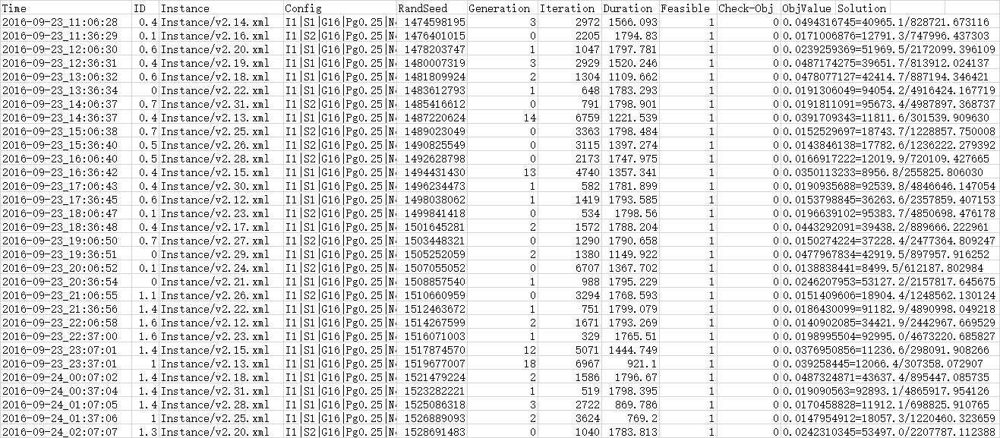
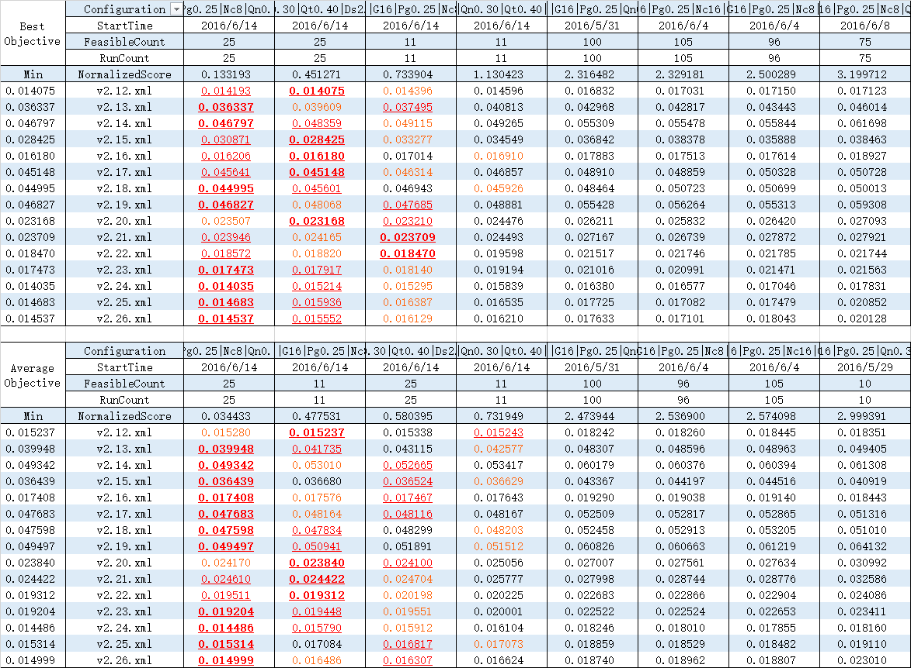

算法研发和常规软件开发十分相似, 但也有很多区别.
大多数工程项目往往更注重正确性, 为了提升代码的健壮性与可维护性, 可以适当牺牲性能.
而设计精妙的高效而复杂算法代码往往具有极高的耦合度, 难以进行系统的单元测试.
此外, 算法面临的需求往往不那么简单直接, 不是梳理清楚了业务逻辑就能欢快地敲代码了的.
算法研发真的这么任性吗?

# 软件工程

## 文档

- 需求分析
  - 相关技术调研
  - 自然语言描述
  - 基本概念定义
  - 建模四要素
  - 输入输出数据约定
- 用户手册
  - 概要设计
  - 接口定义
  - 功能覆盖
- 算法设计
  - 技术规范
  - 模块划分
  - 处理流程
- 测试分析
  - 测试环境
  - 测试用例
  - 测试结果
  - 正确性分析
  - 优度分析
  - 速度分析

## 算例设计

- 格式要求
  - 自文档
  - 跨平台
  - 推荐格式: protobuf, json
- 结构和规模可控
  - 拓扑设计
    - 特殊结构: 树形, 窄总线型, 宽总线型, 关键节点, 局部密度高整体密度低, 有向无环图
    - 部分边权重特别大 (出现整数上溢)

# 算法工程

## 相关工具

### 版本控制工具

- git (主流)
- svn
- mercurial

### 适合与版本控制工具配合使用的文档撰写工具

- Markdown
  - 一种功能非常精简的标记语言
  - https://guides.github.com/features/mastering-markdown/
- LaTeX
  - 功能强大的标记语言
  - 同样适用于科技论文写作

### 数学规划求解器 -- 完成需求分析即完成项目!

- [Gurobi](http://www.gurobi.com/)
  - 目前最高效的求解器
  - 支持免费学术许可证申请
- [CPLEX](https://www.ibm.com/software/commerce/optimization/cplex-optimizer/)
  - IBM旗下的"行业标准"
- [SCIP](http://scip.zib.de/)
  - 号称最快的开源求解器
- [Coin-OR](https://projects.coin-or.org/Cbc)
  - 功能繁多的开源运筹学工具包

## 开发

### 代码可读性

- 使用版本控制减少被注释掉的代码 (文档性注释不受该要求影响)
- 使用有具体意义的单词作为标识符以减少臃肿的注释
- 使用自动排版工具调整代码格式
- 合理的功能模块划分和封装以避免过长的函数 (但是有时真的无法避免)

### 自动化测试

- 使用配置文件
  - 方案选择 (使用配置文件将导致代码过于臃肿时可以考虑预处理语句)
  - 参数设置
  - 算例选择
  - 建议使用json文件格式
- 自动批量测试
  - 计算结果合法性检验
  - 计算结果目标函数值正确性检验
  - 独立重复运行
  - 多个算例
  - 多个配置
  - 多线程 (注意写同一个日志文件时应加入互斥机制)
- 运行日志
  - 原始日志
    - 能够评价每次运行的时空开销与解的质量
    - 能够还原求解过程和结果 (随机种子, 运行时间, 迭代次数, 宏开关状态, 参数设置...)
    - 建议使用csv文件进行组织
  - 初步加工
    - 多阶段问题整合各阶段的数据得到整个周期的结果
  - 举例
    
- 结果分析
  - 初步统计
    - 极值, 均值, 方差, 耗时...
    - ClosedXML编辑xlsx文件
  - 对比分析
    - 在所有算例上的综合评价方案/参数好坏的策略
    - Excel条件格式, 排序, Excel录制宏
  - 举例
    

### 算法工程模块清单

- 通用
  - 验证程序
    - 合法性
    - 目标函数值计算正确
  - 日志记录
  - 统计分析
- 求解器
  - 数学模型
  - 编程实现
- 启发式
  - 初始解
    - 随机
    - 贪心
  - 局部搜索
    - 邻域评估
      - 增量评估
      - 邻域动作目标函数增量缓存
      - 邻域动作优先队列
    - 邻域动作选择
    - 邻域动作执行
  - 禁忌策略
    - 禁忌表
    - 解禁策略
  - 扰动策略
